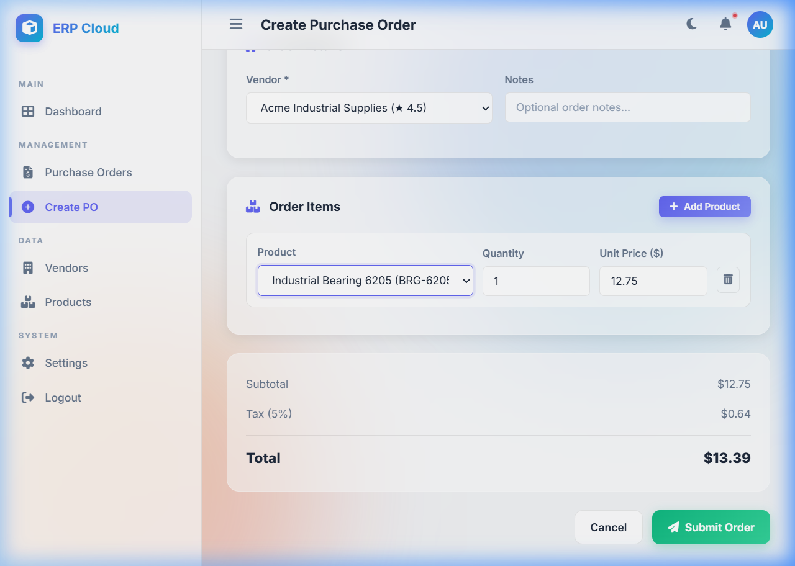
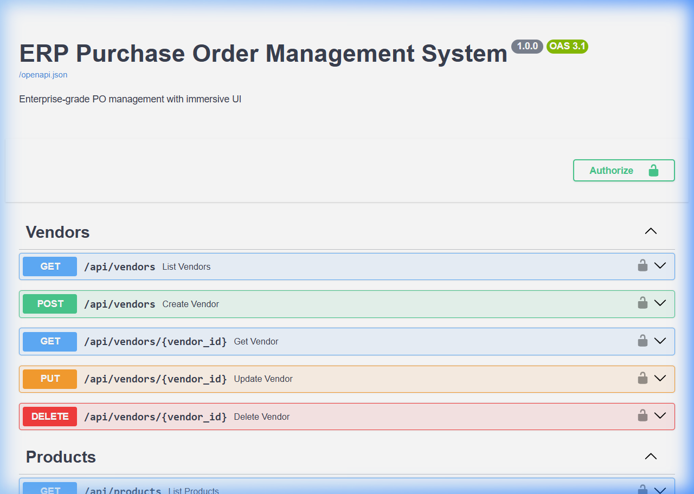
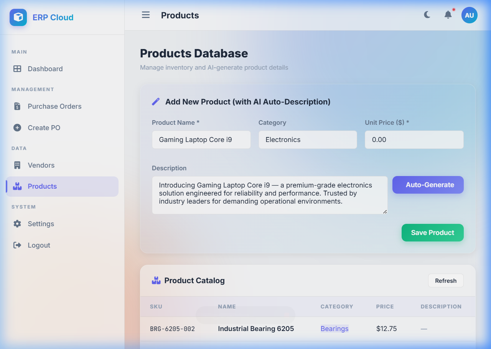

# ERP Purchase Order Management System

> Enterprise-grade PO management with an immersive glassmorphism dashboard, FastAPI backend, and PostgreSQL.

```
┌─────────────────────────────────────────────────────────┐
│                     ARCHITECTURE                        │
│                                                         │
│   ┌──────────┐     ┌──────────┐     ┌──────────────┐   │
│   │ Frontend │────▶│ FastAPI  │────▶│ PostgreSQL   │   │
│   │ (HTML/JS)│◀────│ Backend  │◀────│              │   │
│   └──────────┘     └────┬─────┘     └──────────────┘   │
│                         │                               │
│                    ┌────▼─────┐     ┌──────────────┐   │
│                    │ Auth     │     │ MongoDB      │   │
│                    │ (OAuth)  │     │ (AI Logs)    │   │
│                    └──────────┘     └──────────────┘   │
│                         │                               │
│                    ┌────▼─────┐                         │
│                    │ Gemini / │                         │
│                    │ OpenAI   │                         │
│                    └──────────┘                         │
└─────────────────────────────────────────────────────────┘
```

---

## 📌 Problem Statement

In the modern enterprise supply chain, manual purchase order (PO) workflows suffer from frequent calculation errors, lack of visibility into vendor relationships, and high administrative overhead. Tracking which products belong to which vendor, manually calculating taxes, and drafting detailed product specifications are severely bottlenecked processes.

**This system solves these real-world challenges by:**
* **Automating business logic:** Eliminates human computation errors with strict 5% tax calculations and live line-item totals.
* **Managing vendor-product relationships:** Creates a normalized source of truth preventing incorrect orders.
* **Reducing operational friction:** Leverages AI auto-generation (Gemini/OpenAI) to instantly draft complex product descriptions, massively reducing the manual data-entry burden.

---

## 🗄 Database Design

The database employs **PostgreSQL** following strict Third Normal Form (3NF) principles to ensure data normalization, prevent anomalies, and guarantee referential integrity. 

### Tables & Relationships

1. **`vendors`**
   * **Primary Key:** `vendor_id`
   * Stores enterprise data (Name, Contact, Rating).
   * **Relationship:** 1-to-many with Purchase Orders.

2. **`products`**
   * **Primary Key:** `product_id`
   * Stores inventory details (SKU, Name, Unit Price). 
   * **Unique Constraint:** `sku` prevents duplicate item tracking.

3. **`purchase_orders`**
   * **Primary Key:** `po_id`
   * **Foreign Key:** `vendor_id` (References `vendors.vendor_id`)
   * Core order entity tracking total amounts, strict `Approved`/`Pending` lifecycle statuses, and generated `reference_no`.

4. **`purchase_order_items`**
   * **Primary Key:** `po_item_id`
   * **Foreign Keys:** `po_id` (References `purchase_orders.po_id`) and `product_id` (References `products.product_id`)
   * Bridges the many-to-many relationship between orders and products. Tracks line-item `quantity` and `line_total`.
   * **Referential Integrity:** `ON DELETE CASCADE` ensures deleted POs naturally purge their linked internal items.

---

## ⚙ Dynamic UI Logic

The frontend utilizes modular vanilla JavaScript (`frontend/js/po.js`) mapped to an asynchronous API to provide a seamless, non-blocking user experience:

* **Handling Multiple Product Rows:** The DOM dynamically appends independent row wrappers (`<div class="item-row">`) directly into the `itemsContainer` without refreshing the page.
* **Add Row & Remove Row Buttons:** JavaScript isolates the specific DOM element array index (`itemRowIndex`) for safe, independent addition/deletion via `removeItemRow()`.
* **Live Total Calculation:** Event listeners (`oninput`) are bound to quantity and price fields. Whenever arbitrary edits are made, `recalcTotals()` scans the DOM array, multiplies `qty × price`, calculates the 5% tax, and injects updated `.innerText`.
* **Product Price Auto-fill:** On category dropdown selection (`onProductChange()`), the UI extracts the `data-price` HTML attribute natively populated from the database API and auto-fills the cost node.

---

## 📊 System Workflow

The complete end-to-end working flow is structured as follows:

1. **User Login:** Authenticates locally or via Google OAuth, receiving an encrypted JWT access token spanning session limits.
2. **Fetch Vendors:** Dashboard API call loads the normalized vendor array from PostgreSQL securely.
3. **Fetch Products:** Sidebar action requests product catalogue (SKU, constraints).
4. **Create Purchase Order:** User navigates to creation form, dynamically adding product nodes and filling quantities.
5. **Calculate Total:** Client-side JavaScript parses live values; calculates a strictly enforced automated 5% tax.
6. **Save Order:** Form submission fires `POST /api/purchase-orders`, where the backend validates the payload, re-verifies total server-side, writes to database tables securely, and logs AI interaction contexts (if used) to MongoDB.
7. **Display Dashboard:** Router redirects client back to `dashboard.html` injecting real-time aggregated values and showing the newly pending PO.

---

## 📸 Screenshots Section

_Below are visual demonstrations of the system functionalities:_

* **Dashboard Screenshot**  
  

* **Create PO Screenshot**  
  

* **Swagger Docs Screenshot**  
  

* **AI Feature Screenshot**  
  

---

## 🚀 Future Enhancements

The modular microservice-style design inherently supports massive horizontal scaling. Near-term suggestions:
* **Real-time notifications:** Integrating WebSockets (`socket.io` or FastAPI native) for immediate alerts on PO status shifts.
* **Role-based access control (RBAC):** Expanding JWT to separate standard requesters from administrative approvers.
* **CI/CD integration:** Embedding automated GitHub Actions for strict unit testing and automated Dockerhub builds.
* **Email alerts:** Hooking `SendGrid` or `AWS SES` into the database trigger to physically email approved purchase agreements to the dynamic Vendor contacts.
* **Reporting analytics:** Detailed BI visualizations aggregating quarterly supply-chain overhead spending constraints.

---

## 🧪 Testing Guide

Follow these steps precisely to test system execution:

1. **Login:** Navigate to `/static/login.html` and click the "Quick Dev Login" bypass.
2. **Create Vendor:** (Requires API call or DB seed testing) Verify the 4 default bootstrapped vendors exist in your instance.
3. **Create Product:** Access the newly integrated *Products* menu tab, and use the magic "Auto-Generate" description function.
4. **Create Purchase Order:** Access the *Create PO* tab. Select a verified vendor dropdown item.
5. **Add Multiple Items:** Map 3 different products to this specific order instance using the "+" UI component.
6. **Verify Total Calculation:** Test validation limits by modifying item quantities manually. Ensure JavaScript calculates precisely `(Items) + 5% Tax`.
7. **Persist Order:** Press submit and verify that `dashboard.html` maps the reference creation.

---

## 🛠 Troubleshooting

**Database connection failed:**
Confirm the `.env` variable precisely matches Docker's service container (`postgresql://erp_user:erp_password@db:5432/erp_db`). Run `docker-compose logs db` to review failure traces.

**Missing environment variables:**
If Google OAuth or Gemini fail, ensure `.env.example` was fully migrated to `.env` with actual registered API tokens. 

**API not responding:**
Likely a Python `uvicorn` failure. Ensure all environment dependencies are installed via `pip install -r backend/requirements.txt` and review terminal logs for port `8000` binding exceptions.

---

## 🎓 Assignment Requirements Validation

This repository acts as professional proof of requirement fulfillment:

* ✔ **RESTful API usage:** Evident in `backend/routes/`. Distinct endpoints specifically encapsulate logical entities mapping standard GET, POST, PUT definitions natively handled by FastAPI.
* ✔ **Database relationships:** Reflected in `backend/models.py`. One-to-Many ties map Vendors to PO objects (`vendor.purchase_orders`) directly correlating robust internal logic.
* ✔ **Dynamic UI logic:** Fully demonstrated by `frontend/js/po.js`, isolating pure functional row insertion and node calculations free of external bloated libraries.
* ✔ **OAuth authentication:** Configured in `backend/auth.py` natively routing robust JSON Web Tokens securely via HTTP callbacks.
* ✔ **Business logic calculation:** Strict backend parsing isolates a 5% fixed tax calculation and line-total mapping executed purely inside `backend/crud.py` prior to database commit.
* ✔ **SQL schema usage:** Located explicitly at `schema.sql` demonstrating constraints, sequence mapping, and explicit DDL parameters.

---

## 📁 GitHub Folder Structure

The repository conforms to professional industry standards:

```
ERP-PO-System/
├── backend/                  # FastAPI logic and models
├── frontend/                 # Client UI, CSS, and JS
├── screenshots/              # Visual system demonstrations
├── database/                 # Backup utilities
│   ├── README.md             # Export instructions
│   └── export.sql            # (Generated database dump)
├── .github/                  # CI/CD and Issue Templates
├── schema.sql                # DDL Database architecture
├── seed_data.sql             # Sandbox DML configurations
├── Dockerfile                # Image instantiation script
├── docker-compose.yml        # Multi-container orchestrator
├── .env.example              # Public credential structure
├── .gitignore                # Explicit untracked file logic
├── requirements.txt          # Python dependency mapping
└── README.md                 # System overview and entry
```
